*An Ansible Validated Content collection that gathers SOS reports from RHEL hosts and OCP nodes, OpenShift must-gathers, and AAP API diagnostics, then creates Red Hat Support Cases and uploads everything via the CRM v3 API.*

If your organization runs **Red Hat Enterprise Linux (RHEL)** hosts, **OpenShift Container Platform (OCP)** clusters, and **Ansible Automation Platform (AAP)** for managing it all, opening a Red Hat Support Case with the right diagnostics attached is a workflow you know too well. An engineer SSHes into RHEL hosts to run **`sos report`**, logs into one or more OCP clusters to run **`oc adm must-gather`**, opens the AAP UI to export configuration, then navigates to the **Red Hat Customer Portal** to create a case, fill in product and severity, upload files one at a time (with a **250 MB limit** on the legacy API), and paste comments. Across 3 clusters and 5 RHEL hosts, a single well-documented case can consume **over an hour** of context-switching. Under incident pressure at 3 a.m., steps get skipped, files get mis-labeled, and cases sit without diagnostics until the next business day.

I contribute to an Ansible collection that automates this entire lifecycle. It is called **`infra.support_assist`**, published under the **Red Hat Communities of Practice** ([`redhat-cop`](https://github.com/redhat-cop)) organization and available as **Ansible Validated Content** on both Ansible Galaxy and Red Hat Automation Hub. Created by [Lenny Shirley](https://github.com/lennysh) and [me](https://github.com/dfmateus), the collection ships **6 roles** and **7 playbooks** covering the full diagnostic-to-case-upload pipeline.

- 📦 **Ansible Galaxy:** `ansible-galaxy collection install infra.support_assist`
- 🔗 **GitHub Repository:** [redhat-cop/infra.support_assist](https://github.com/redhat-cop/infra.support_assist)
- 🏷️ **Automation Hub:** Available as [Ansible Validated Content](https://console.redhat.com/ansible/automation-hub) on the Red Hat Hybrid Cloud Console

> ⚡ **TL;DR:**
>
> **The Problem:** Gathering diagnostics (SOS reports, OCP must-gathers, AAP API exports) and managing Red Hat Support Cases is a manual, error-prone workflow that fragments across SSH sessions, CLI tools, and the web portal.
>
> **The Solution:** A single Ansible collection with 6 roles and 7 playbooks that automates gathering, case creation, file upload, and commenting via the CRM v3 API. Version 1.3.0 removed all v1 code paths ahead of the September 21, 2026 deprecation deadline.
>
> **The Impact:** Diagnostics gathered and uploaded in a single playbook run. Zero portal clicks. Files up to 5 GB via presigned S3 URLs. Runs on AAP as a Job Template or from the CLI with `ansible-playbook`.

## 🚨 The problem: manual diagnostics under incident pressure

In a standard Red Hat environment, every support case that requires diagnostic data triggers a sequence of disconnected manual steps spread across different tools, protocols, and interfaces.

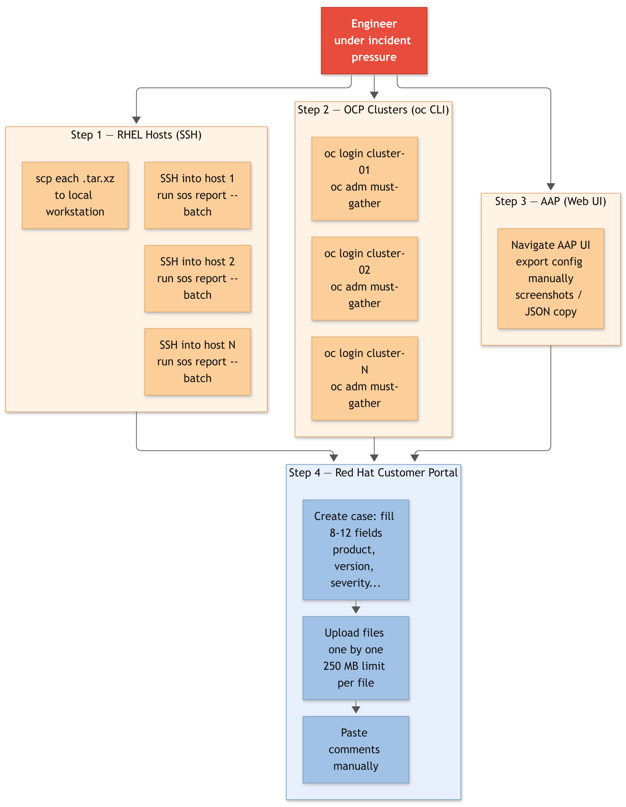

**Manual Workflow Breakdown:**

- **1. RHEL Diagnostics (SSH):** The engineer SSHes into each RHEL host, runs `sos report --batch`, waits for completion (up to 10 minutes per host), then `scp`s the resulting `.tar.xz` archive to a local workstation.
- **2. OpenShift Diagnostics (oc CLI):** The engineer logs into each OCP cluster, runs `oc adm must-gather`, waits 10 to 30 minutes depending on cluster size, and manually extracts the output from the generated directory.
- **3. AAP Diagnostics (Web UI):** The engineer navigates the AAP UI to find relevant configuration screens, takes screenshots or copies JSON from the API browser. No structured export exists for "everything Support needs to see."
- **4. Case Management (Customer Portal):** The engineer opens the [Red Hat Customer Portal](https://access.redhat.com/support/cases/#/case/new), fills in 8 to 12 fields (product, version, severity, description, environment), uploads files one at a time through a web form, and pastes comments manually.
- **5. Repeat for Every Host and Cluster:** Every step above multiplies by N hosts and M clusters. With 5 RHEL hosts and 3 OCP clusters, an engineer runs 5 separate `sos report` commands, 3 separate `oc adm must-gather` commands, and uploads 8+ files individually through the portal.

> **🚨 The Operational Cost of Manual Diagnostics**
>
> A single OCP must-gather with case creation and upload takes **15 to 20 minutes** manually. Collecting SOS reports from 5 RHEL hosts adds another **30 to 50 minutes** of sequential SSH sessions. The full diagnostic-to-upload cycle for one incident case across a moderately sized environment can easily exceed **one hour** of an engineer's time, spent on logistics instead of solving the actual problem.

## ⚙️ The solution: one collection, three diagnostic sources, one API

The collection wraps all three diagnostic sources and the full case lifecycle into a single automation pipeline. Each playbook follows the same pattern: validate prerequisites, gather diagnostics, refresh the Red Hat API token, and create or update the support case with file uploads and structured comments.

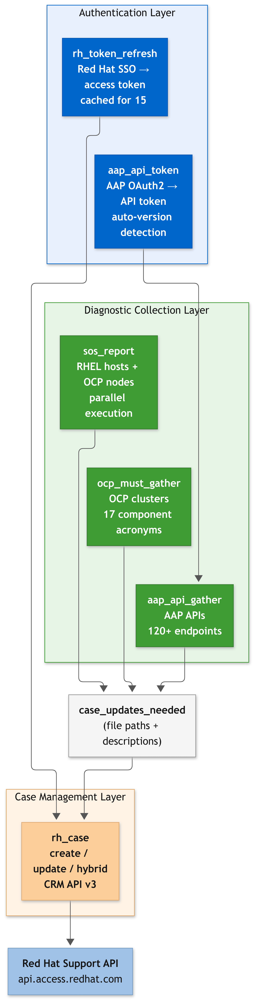

**Architecture Breakdown:**

- **1. Authentication Layer (2 roles):** `rh_token_refresh` exchanges a Red Hat offline token for a short-lived API access token (cached for 15 minutes). `aap_api_token` obtains an AAP OAuth2 token with automatic version detection (Gateway 2.5+ vs. legacy Controller).
- **2. Diagnostic Collection Layer (3 roles):** `sos_report` runs `sos report` on RHEL hosts (via SSH) or OCP nodes (via `oc debug` or node SSH) in parallel. `ocp_must_gather` runs `oc adm must-gather` with automatic component image resolution. `aap_api_gather` queries 120+ AAP API endpoints across Controller, Hub, Gateway, and EDA, saving JSON responses and creating an archived bundle.
- **3. Case Management Layer (1 role):** `rh_case` is the unified role for creating and updating Red Hat Support Cases. It auto-detects whether to create, update, or do both (hybrid mode), and handles comments and file uploads through the Red Hat Support API.
- **4. Data Flow Contract:** Every diagnostic role outputs a standardized `case_updates_needed` list, containing file paths and descriptions. The `rh_case` role consumes this list to upload attachments and post comments. This decouples data gathering from case management.
- **5. Orchestration Layer (7 playbooks):** Each playbook wires the layers together with `block`/`rescue` error handling, ensuring clean failure messages and automatic cleanup if any stage fails.

## 📊 Manual diagnostics vs automated pipeline

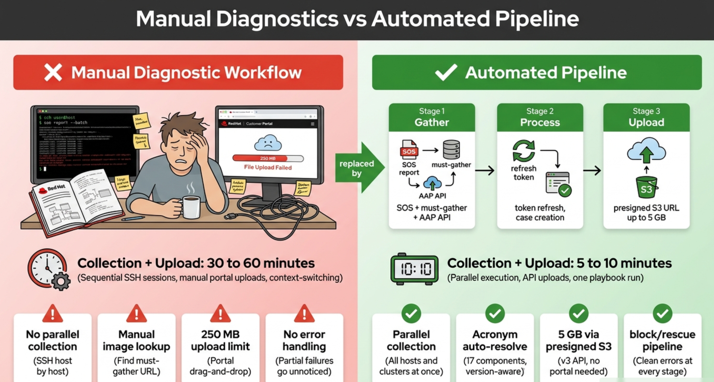

**Key Operational Impact Breakdown:**

- **1. Diagnostics Collection Time:** Drops from **30 to 60 minutes** of sequential SSH/`oc` sessions across N hosts and clusters down to a **single playbook run in 5 to 10 minutes**, with parallel host execution for SOS reports and automatic image resolution for must-gathers.
- **2. Case Creation:** Eliminates **8 to 12 manual portal clicks** and free-text field entry with **zero clicks**: product, version, severity, and description are API-validated YAML fields passed as role variables.
- **3. Attachment Upload:** Replaces **portal drag-and-drop** one file at a time with a **250 MB limit** (v1 API) with **automated API upload** supporting files up to **5 GB** each via presigned S3 URLs (v3 API).
- **4. Multi-Host SOS Collection:** Transforms **sequential SSH sessions** (one host at a time, manual `scp` to fetch each archive) into **parallel Ansible execution** across all inventory hosts, with automatic fetch and organization by case ID and hostname.
- **5. Must-Gather Component Selection:** Replaces **manual image URL lookup** in Red Hat documentation per OCP component with a **single acronym** (e.g., `AAP`, `ODF`, `RHACM`), auto-resolving the correct must-gather image URL from the installed operator version.
- **6. Error Handling:** Upgrades from **no structured handling** (partial failures leave cases incomplete with no indication of what was missed) to **`block`/`rescue` in every playbook**, producing clear error messages and stopping the pipeline before uploading incomplete data.
- **7. Case Comment Formatting:** Replaces **manual copy-paste** of cluster information (name, version, image used, time window) with **Jinja2 templates** that auto-populate structured comments from gathered facts.
- **8. Fleet Scale:** Eliminates the **multiplicative manual cost** of repeating every step across N clusters and hosts. One inventory file, one playbook run, one case with all diagnostics attached.

## 🔧 How it works: the pipeline pattern

Every playbook in the collection follows the same three-stage pipeline with `block`/`rescue` error handling at each stage.

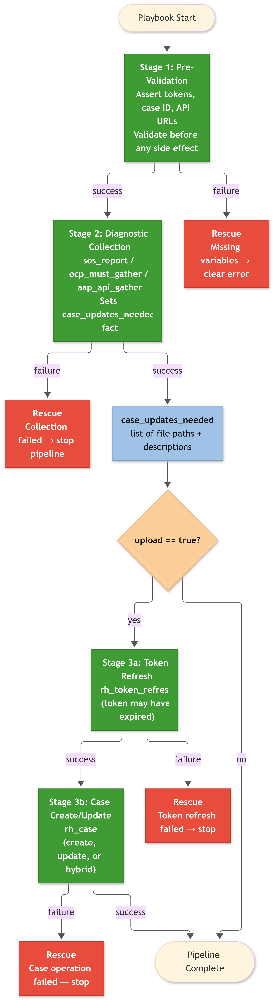

**Pipeline Stage Breakdown:**

- **1. Pre-Validation:** Asserts that required variables are present (tokens, case ID, API URLs) before any side effect. If upload is enabled (`upload: true`), validates both the Red Hat API token and the case configuration up front.
- **2. Diagnostic Collection:** Runs the main diagnostic role (`sos_report`, `ocp_must_gather`, or `aap_api_gather`). Each role sets the `case_updates_needed` fact with the files it produced. If this stage fails, the `rescue` block stops the pipeline with a clear error message.
- **3. Upload:** Refreshes the Red Hat API token (since diagnostic collection may have taken 30+ minutes), then calls `rh_case` to create or update the case. The `rh_case` role iterates through `case_updates_needed`, uploading each file and posting comments.

> **💡 The `case_updates_needed` Contract**
>
> Every diagnostic role outputs a standardized list of dictionaries with `attachment` (file path) and `attachmentDescription` (human-readable label) keys. This is the glue between diagnostic roles and the `rh_case` role. You can also construct this list manually to upload arbitrary files to any case:
>
> ```yaml
> case_updates_needed:
>   - attachment: "/tmp/must-gather.tar.gz"
>     attachmentDescription: "OCP must-gather output from cluster hub-01"
>   - attachment: "/tmp/custom-diagnostic.log"
>     attachmentDescription: "Application thread dump from 2026-09-16"
> ```

## 🔍 Gathering diagnostics: SOS reports, must-gathers, and AAP API dumps

### SOS reports from RHEL hosts and OCP nodes

The `sos_report` role supports three collection modes:

- **`standard` (default):** Runs on target RHEL hosts via SSH. Installs the `sos` package if missing, generates the report with the case ID as a label, fetches the resulting `.tar.xz` archive to the control node organized by case and hostname, and optionally removes the report from the target host after fetch.
- **`ocp_debug`:** Runs from `localhost` using `oc debug node/` to collect SOS reports from RHCOS nodes without requiring SSH access. Auto-discovers cluster nodes via `oc get nodes` with optional label selector filtering (`sos_report_ocp_node_selector`). Falls back to SSH if `oc debug` fails on a node.
- **`ocp_ssh`:** SSHes directly into RHCOS nodes using the `core` user and a `support-tools` container for SOS execution, matching the [Red Hat KCS procedure](https://access.redhat.com/solutions/3820762). Supports bastion/ProxyJump configurations.

```bash
# Standard mode: RHEL hosts via SSH
ansible-playbook -i inventory infra.support_assist.sos_report_rhel \
  -e redhat_offline_token="$REDHAT_OFFLINE_TOKEN" \
  -e case_id=01234567 \
  -e upload=true \
  -e clean=true

# OCP debug mode: RHCOS nodes via oc debug (no SSH required)
ansible-playbook infra.support_assist.sos_report_ocp \
  -e sos_report_ocp_server_url="https://api.prod-cluster.example.com:6443" \
  -e sos_report_ocp_token="sha256~..." \
  -e case_id=01234567 \
  -e upload=true \
  -e redhat_offline_token="$REDHAT_OFFLINE_TOKEN"
```

In standard mode, the playbook runs on `hosts: all`, so every host in the inventory generates a report in parallel. After all hosts complete, an aggregation step combines `case_updates_needed` from every host using a Jinja2 loop over `ansible_play_hosts`, then uploads all reports to the case in a single batch. The output is organized as:

```
/tmp/sos_reports/case_01234567/hostname1/sosreport-hostname1-01234567-*.tar.xz
/tmp/sos_reports/case_01234567/hostname2/sosreport-hostname2-01234567-*.tar.xz
```

> **💡 AAP Containerized Deployments**
>
> For AAP installations using the containerized deployment method, set `containerized=true` (or pass `-e containerized=true`). The role adjusts the `sos report` invocation to handle the containerized runtime layout. The `inventory-aap-containerized` example file in the repository shows the expected group structure: `automationgateway`, `automationcontroller`, `execution_nodes`, `automationhub`, `automationeda`, and `redis`.

### OCP must-gathers with acronym-based component selection

The `ocp_must_gather` role eliminates the most tedious part of running a must-gather for a specific OpenShift component: **finding the correct container image URL**. Instead of looking up the image in Red Hat documentation, extracting the installed operator version, and constructing the full registry path, you pass a **single acronym** and the role handles everything.

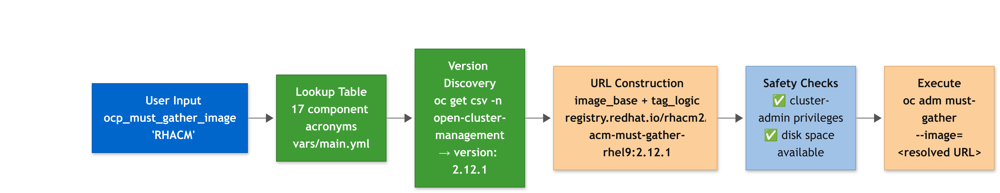

**Image Resolution Breakdown:**

- **1. Acronym Input:** The user passes `ocp_must_gather_image="AAP"` (or any of the 17 supported acronyms). The role looks up the component in its built-in lookup table.
- **2. Version Discovery:** The role runs the component's `version_command` or `discovery_command` against the live cluster to determine the installed operator version. For example, for RHACM it runs `oc get csv -n open-cluster-management -o jsonpath='{.items[0].spec.version}'`.
- **3. Image URL Construction:** The discovered version is combined with the component's `image_base` and `tag_logic` to produce the full container image URL. For RHACM 2.12.1, that yields `registry.redhat.io/rhacm2/acm-must-gather-rhel9:2.12.1`.
- **4. Safety Checks:** Before running the long-running must-gather command, the role verifies `cluster-admin` privileges and checks available disk space on the control node.

**17 Supported Component Acronyms:**

| Acronym | Component |
| --- | --- |
| **DEFAULT** | Standard OCP platform must-gather |
| **AAP** | Red Hat Ansible Automation Platform |
| **OSSM** | OpenShift Service Mesh |
| **CNV** | OpenShift Virtualization |
| **ODF** | OpenShift Data Foundation |
| **GITOPS** | OpenShift GitOps |
| **LOGGING** | OpenShift Logging |
| **RHOAI** | OpenShift AI |
| **RHACM** | Advanced Cluster Management |
| **LVM** | LVM Operator |
| **SVLS** | OpenShift Serverless |
| **MTC** | Migration Toolkit for Containers |
| **OADP** | OpenShift APIs for Data Protection |
| **LSO** | Local Storage Operator |
| **PTP** | PTP Operator |
| **SEC** | Secrets Store CSI Driver Operator |
| **NRO** | NUMA Resources Operator |
| **COMP** | Compliance Operator |

```bash
# Gather RHACM must-gather with time window and upload to case
ansible-playbook infra.support_assist.ocp_must_gather \
  -e ocp_must_gather_server_url="https://api.hub-01.example.com:6443" \
  -e ocp_must_gather_token="sha256~..." \
  -e ocp_must_gather_image="RHACM" \
  -e ocp_must_gather_since="12h" \
  -e case_id=01234567 \
  -e upload=true \
  -e redhat_offline_token="$REDHAT_OFFLINE_TOKEN"
```

> **🛡️ Disconnected Environment Support**
>
> For air-gapped or disconnected clusters where `registry.redhat.io` is unreachable, set `ocp_must_gather_disconnected_mode: true` and provide the mirror registry URL via `ocp_must_gather_disconnected_registry`. The role rewrites the image URL to pull from your internal registry instead.

### AAP API diagnostics across Controller, Hub, Gateway, and EDA

The `aap_api_gather` role queries **120+ API endpoints** across four AAP components (Controller, Hub, Gateway, and EDA), saves each response as a JSON file, and compresses everything into a `.tar.gz` archive ready for case upload.

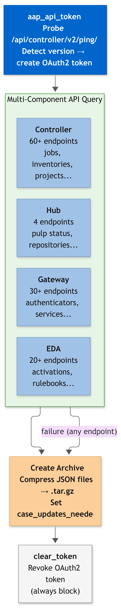

**AAP API Gather Breakdown:**

- **1. Version Detection:** The `aap_api_token` role probes `/api/controller/v2/ping/` (new Gateway path) and falls back to `/api/v2/ping/` (legacy Controller path) to determine the AAP version. This controls which API paths the gather role queries.
- **2. Multi-Component Query:** For each enabled component (`controller`, `hub`, `gateway`, `eda`), the role iterates through its endpoint list, querying each one with pagination support (configurable max pages per endpoint). Failed requests are logged but do not stop the collection.
- **3. JSON Archive:** All collected JSON files are compressed into a single `.tar.gz` archive stored in `aap_api_gather_dest` (default: `/tmp/aap_api_gathers`). The archive is added to `case_updates_needed` for upload.
- **4. Token Cleanup:** The `aap_api_gather` playbook uses an `always` block to revoke the AAP OAuth2 token after collection completes, even if the gather fails. This prevents token accumulation on the Controller.

> **💡 Cascading Variable Resolution**
>
> All roles resolve credentials through a cascading chain: extra-vars first, then environment variables with compatibility aliases (`AAP_HOSTNAME` → `CONTROLLER_HOST` → `TOWER_HOST`), then role defaults. This means the same playbook works unchanged across AAP Gateway 2.5+, standalone Controller 4.x, and legacy Ansible Tower without modifying a single variable name.

## 📋 Managing cases via API: create, comment, upload

The `rh_case` role is the unified interface for all Red Hat Support Case operations. It auto-detects its operation mode based on which variables are provided.

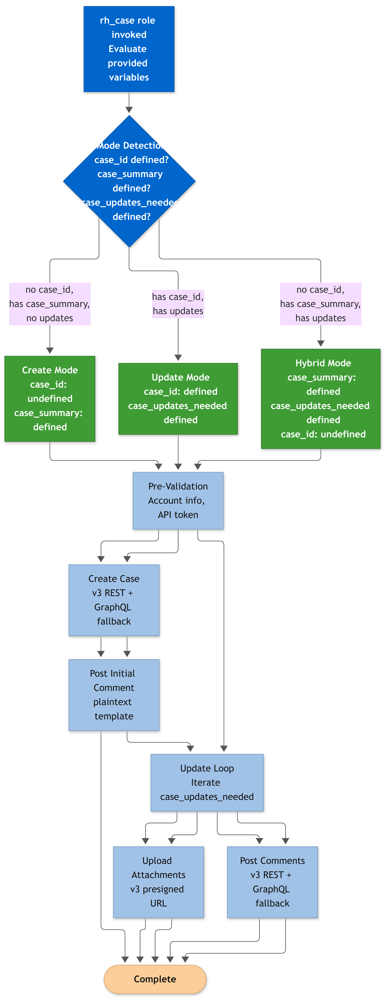

**Mode Detection Breakdown:**

- **1. Create Mode:** When `case_id` is not defined and creation fields (`case_summary`, `case_product`, `case_severity`) are provided. Creates a new case via the Red Hat Support API.
- **2. Update Mode:** When `case_id` is defined and `case_updates_needed` contains files or comments. Uploads attachments and posts comments to an existing case.
- **3. Hybrid Mode:** When both creation fields and `case_updates_needed` are present. Creates the case first, then immediately uploads all attachments and posts comments in a single playbook run.

This hybrid-mode example creates a case and uploads diagnostics in one run:

```yaml
---
- name: "Create case and upload OCP diagnostics"
  hosts: localhost
  connection: local
  gather_facts: false
  vars:
    redhat_offline_token: "{{ vault_offline_token }}"
    case_summary: "Pod scheduling failures after OCP 4.16 upgrade"
    case_description: >-
      Pods in namespace production-app are failing to schedule on
      worker nodes after upgrading from OCP 4.15 to 4.16. Events
      show 'Insufficient memory' on nodes with 64 GB available.
    case_product: "OpenShift Container Platform"
    case_product_version: "4.16"
    case_type: "Defect / Bug"
    case_severity: "2 (High)"
  tasks:
    - name: "Run OCP must-gather"
      ansible.builtin.include_role:
        name: infra.support_assist.ocp_must_gather
      vars:
        ocp_must_gather_server_url: "https://api.prod-cluster.example.com:6443"
        ocp_must_gather_token: "{{ vault_ocp_token }}"

    - name: "Refresh Red Hat API token"
      ansible.builtin.include_role:
        name: infra.support_assist.rh_token_refresh

    - name: "Create case and upload must-gather"
      ansible.builtin.include_role:
        name: infra.support_assist.rh_case
```

The `ocp_must_gather` role sets `case_updates_needed` with the archive path. The `rh_case` role sees that `case_id` is undefined but `case_summary` and `case_updates_needed` are both present, so it enters hybrid mode: create the case, then upload the must-gather archive and post a structured comment with cluster details.

## ⚡ CRM API v3: what changed and why v1 is gone

Red Hat is decommissioning the **CRM API v1** endpoints on **September 21, 2026** ([Article 7146730](https://access.redhat.com/articles/7146730)). Version 1.3.0 of the collection **removed all v1 code paths** and uses v3 exclusively. There is no `rh_case_crm_api_version` variable anymore; v3 is the only implementation.

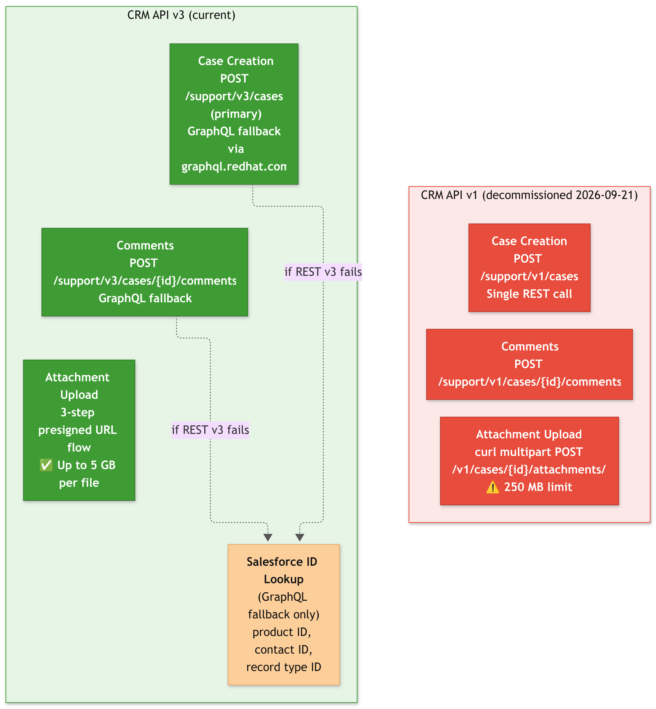

**What changed from v1 to v3:**

- **1. Case Creation:** v1 used `POST /support/v1/cases` (a single REST call). v3 uses `POST /support/v3/cases` as the primary path, with a **GraphQL fallback** via `graphql.redhat.com` if REST v3 returns 4xx/5xx. The GraphQL path uses the `CreateNewCase` mutation and requires Salesforce ID lookups (product ID, contact ID, record type ID) via a new `0b-salesforce-lookup.yml` task.
- **2. Comments:** v1 used `POST /support/v1/cases/{id}/comments`. v3 uses `POST /support/v3/cases/{id}/comments` (REST primary), with a **GraphQL fallback** (`CaseComment__cCreate` mutation) when REST fails. Comment templates are now **plaintext**, since the v3 API does not render markdown.
- **3. Attachment Upload:** v1 used `curl` with a multipart POST to `/v1/cases/{id}/attachments/`, limited to **250 MB**. v3 uses a **3-step presigned URL flow** supporting files up to **5 GB** each. The `curl` dependency is no longer required by the role itself.
- **4. Account Resolution:** v3 requires account metadata (account number, account name) fetched from `/support/v3/accounts` before case creation. The role handles this automatically during pre-validation.

### The v3 presigned URL attachment flow

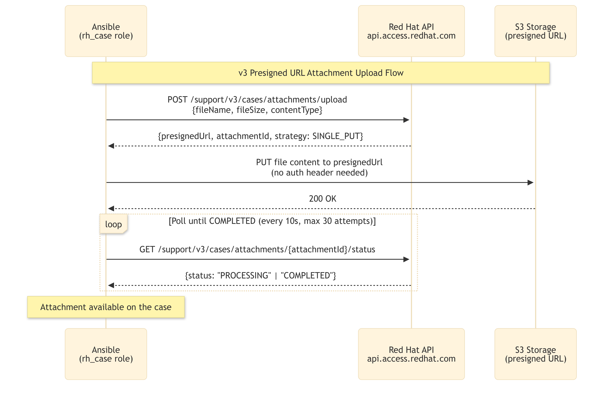

**Presigned Upload Breakdown:**

- **Step 1, Initiate:** `POST /support/v3/cases/attachments/upload` with the file name, size, and MIME type. The API returns a `presignedUrl` (a time-limited S3 upload URL) and an `attachmentId`.
- **Step 2, Upload:** `PUT` the file content directly to the presigned URL. This goes straight to S3 storage, bypassing the Red Hat API server entirely. No authentication header is needed because the presigned URL carries the authorization.
- **Step 3, Poll:** `GET /support/v3/cases/attachments/{attachmentId}/status` until the status transitions to `COMPLETED`. The role polls every 10 seconds for up to 30 attempts (5 minutes). For files close to 5 GB, increase `rh_case_attachment_poll_retries`.

> **⚠️ CRM API v1 Decommission: September 21, 2026**
>
> CRM API v1 endpoints **stop accepting requests on September 21, 2026**. If you are running `infra.support_assist` < 1.3.0, update immediately. Version 1.3.0 removed all v1 code and uses v3 exclusively. No configuration change is needed after the update.

## 🔑 Token management: Red Hat SSO and AAP OAuth2

The collection manages two separate authentication flows, each handled by a dedicated role.

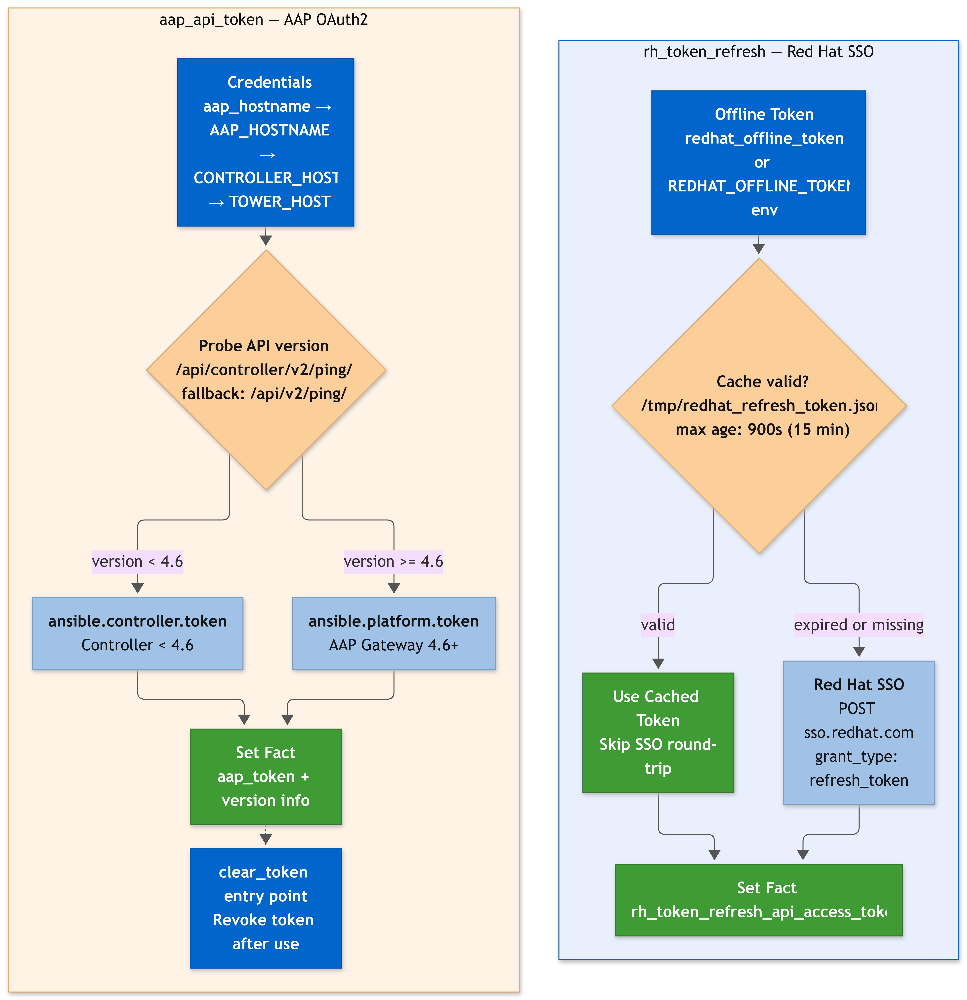

**Token Management Breakdown:**

- **1. Red Hat SSO (`rh_token_refresh`):** Takes a Red Hat offline token (from `redhat_offline_token`, `offline_token`, or the `REDHAT_OFFLINE_TOKEN` environment variable) and exchanges it for a short-lived access token via the Red Hat SSO token endpoint (`sso.redhat.com`). The token is cached locally in a JSON file (`/tmp/redhat_refresh_token.json`) with a configurable max age (default: **900 seconds / 15 minutes**). Subsequent calls reuse the cached token if it has not expired, avoiding unnecessary SSO round-trips during long playbook runs.
- **2. AAP OAuth2 (`aap_api_token`):** Probes the AAP instance to detect its version. For AAP 4.6.0+ (Gateway architecture), it uses `ansible.platform.token`. For older versions, it falls back to `ansible.controller.token`. The role also ships a `clear_token` entry point that revokes the token after operations complete, preventing token accumulation on the Controller.
- **3. Proxy Support:** Both token roles support proxy configuration via `use_proxy` and `http_proxy` variables, with role-prefixed equivalents (`rh_token_refresh_use_proxy`, `aap_api_token_use_proxy`) for explicit control when composing multiple roles.
- **4. Sensitive Data Protection:** All token operations use `no_log: true` by default. The `var_no_log` variable controls this globally across all roles, allowing temporary debug logging during development without modifying individual task files.

## 🎛️ Design patterns worth noting

- **Role-prefixed variables:** Every role uses the pattern `role_name_variable_name` (e.g., `rh_case_attachment_poll_retries`, `ocp_must_gather_since`) to avoid Ansible variable precedence conflicts when multiple roles are composed in a single playbook. Short aliases like `upload` and `clean` are supported via Jinja2 fallback chains for CLI convenience.
- **Fact-based role chaining:** The `case_updates_needed` fact is the collection's internal API. Diagnostic roles produce it, the `rh_case` role consumes it. You can compose any combination of diagnostic roles in a custom playbook and the upload stage works unchanged.
- **Block/rescue in every playbook:** All 7 playbooks wrap each pipeline stage in `block`/`rescue`, ensuring clean failure messages at every boundary. The `any_errors_fatal: true` flag on the `ocp_must_gather` playbook stops execution immediately on any host failure.
- **Async operations:** Both `ocp_must_gather` and `sos_report` run their data-collection commands asynchronously with configurable timeouts (default: 30 minutes), allowing long-running collections without Ansible's SSH connection timing out.
- **Jinja2 templates for case comments:** The `ocp_must_gather` role uses a Jinja2 template (`templates/support_case_comment.j2`) to generate structured comments with cluster name, cluster ID, OCP version, must-gather image used, time window, and file name. This ensures consistent, machine-readable comments on every case.

## 🖥️ Running it on AAP

When running the collection playbooks as AAP Job Templates, three configuration points are essential.

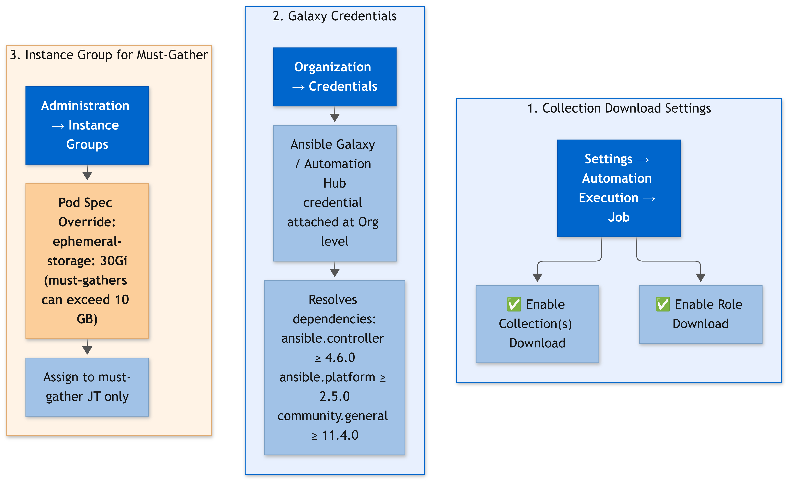

**AAP Configuration Breakdown:**

- **1. Collection Download:** In **Settings → Automation Execution → Job**, enable both **"Enable Collection(s) Download"** and **"Enable Role Download"**. Without these, AAP cannot resolve `infra.support_assist` from Galaxy or Automation Hub at job launch time.
- **2. Galaxy Credentials:** Attach **Ansible Galaxy/Automation Hub** credentials at the **Organization** level. The collection depends on `ansible.controller`, `ansible.platform`, and `community.general`, all of which must be resolvable from the configured content sources.
- **3. Instance Group Pod Spec for Must-Gather:** OCP must-gathers can produce archives exceeding **10 GB**. The default ephemeral storage on AAP execution pods is insufficient. Create a dedicated Instance Group with a Pod Spec Override that increases `ephemeral-storage` (e.g., `30Gi`) and mounts the `oc` binary. Assign this Instance Group specifically to the must-gather Job Template.

## ⚠️ Limitations and known constraints

**⚙️ Prerequisites & Operational Considerations**

- **Ansible Validated Content, not Certified:** The collection is reviewed and tested by Red Hat but is **not covered under a Red Hat SLA**. Issues and feature requests go to the [GitHub repository](https://github.com/redhat-cop/infra.support_assist/issues), not to a Red Hat support case.
- **v3 Attachment Size:** The v3 presigned URL upload supports files up to **5 GB** using the `SINGLE_PUT` strategy. Files larger than 5 GB require multipart chunked upload, which is not yet implemented in the Ansible role.
- **Dependencies:** Requires `ansible-core >= 2.16.0`, `ansible.controller >= 4.6.0`, `ansible.platform >= 2.5.0`, and `community.general >= 11.4.0`. The `ocp_must_gather` role requires the `oc` CLI binary in the Execution Environment.

## 🏁 Wrap up

The collection is at **version 1.3.0**: 6 roles, 7 playbooks, v3-only case management, and SOS report collection from both RHEL hosts and OCP nodes.

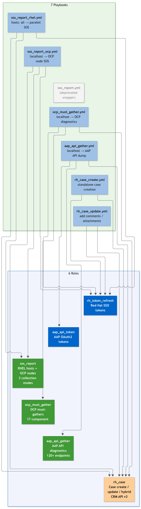

> **📌 Community project notice**
>
> `infra.support_assist` is developed by the [Ansible Community](https://github.com/redhat-cop) (Red Hat Communities of Practice). **It is not an official Red Hat Support tool.** The collection is reviewed and tested as Ansible Validated Content, but it is not covered under a Red Hat SLA and Red Hat Support does not provide troubleshooting for it.
>
> If you encounter problems, have suggestions, or want to contribute code, open an [Issue](https://github.com/redhat-cop/infra.support_assist/issues) or [Pull Request](https://github.com/redhat-cop/infra.support_assist/pulls) on the GitHub repository. The Red Hat community supports this kind of collaboration to improve the support experience for everyone.

🤔 **Ready to stop gathering diagnostics by hand?**

🚀 Grab the collection from Ansible Galaxy or check out the playbooks and usage examples on GitHub:

```bash
ansible-galaxy collection install infra.support_assist
```

- 🔗 **GitHub Repository:** [https://github.com/redhat-cop/infra.support_assist](https://github.com/redhat-cop/infra.support_assist)
- 🏷️ **Automation Hub:** [Red Hat Hybrid Cloud Console](https://console.redhat.com/ansible/automation-hub)

*Contributions, issues, and feature requests are welcome!*
