*An Ansible Automation Platform (AAP) collection that turns N static spoke tokens into one read-only Hub credential using Advanced Cluster Management (ACM) ManagedServiceAccount API*

If your organization runs **Red Hat Advanced Cluster Management (ACM)** for Kubernetes and uses **Ansible Automation Platform (AAP)** or **community AWX** to operate those managed clusters, you probably have one static credential per cluster stored in AAP. Each credential holds a ServiceAccount token that never expires and typically carries `cluster-admin` privileges. With 10 clusters, that is **10 permanent tokens**. With 50, it is **50 attack surfaces**. If any single token leaks, an attacker gets unrestricted access to that cluster forever, with no expiration and no audit trail.

I built an Ansible collection to fix this. It replaces all those per-cluster credentials with a **single read-only credential** on the ACM Hub, fully integrated with AAP and AWX through custom Credential Types, Job Templates, and Workflow Templates. The spoke tokens become temporary, auto-rotated by the klusterlet, and resolved on demand. The collection is called `dfmateus.acm_spoke`.

- 📦 **Ansible Galaxy:** `ansible-galaxy collection install dfmateus.acm_spoke`
- 🔗 **GitHub Repository:** [dfmateus/acm_spoke](https://github.com/dfmateus/acm_spoke)

> ⚡ **TL;DR:**
>
> **The Problem:** Static `cluster-admin` tokens stored in AAP or AWX create high blast radius and severe credential sprawl.
>
> **The Solution:** 1 read-only Hub credential in AAP/AWX paired with auto-rotated temporary spoke tokens via ACM's ManagedServiceAccount API.
>
> **The Impact:** Onboard clusters in under 1 minute; revoke access instantly from the Hub. Fully compatible with enterprise AAP and open-source AWX.

## 🚨 The problem: credential sprawl in AAP

In a standard ACM plus AAP or AWX environment, every Job Template that connects to a spoke cluster needs its own credential registered in the controller. The typical setup looks like this:

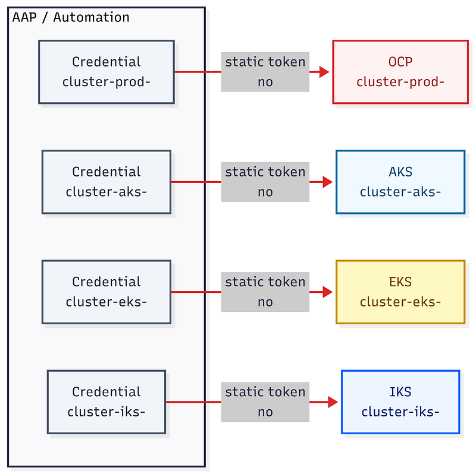

**Legacy Credential Flow Breakdown:**

- **1. Independent Credential Registration:** Every managed spoke cluster requires a dedicated credential generated and stored inside AAP or AWX.
- **2. Unrestricted Bearer Token Mapping:** Each credential stores a permanent, non-expiring token bound to `cluster-admin` privileges.
- **3. Direct Unmonitored Access:** Job Templates authenticate directly to each spoke cluster with zero centralized rotation or Hub oversight.

**Each static token is a liability:**

- **Tokens never expire:** A leaked token gives permanent cluster access until someone finds it and revokes it manually.
- **Full blast radius:** Each token is bound to `cluster-admin`. One leak means **full control** over pods, secrets, RBAC, and workloads.
- **No centralized revocation:** Revoking access requires logging into each spoke, finding the ServiceAccount, deleting the token, and updating the credential in AAP/AWX.
- **Credential sprawl:** N clusters = N **credentials in AAP/AWX**, N ServiceAccounts on spokes, and N secrets to rotate manually.
- **No audit trail:** Token creation, extraction, and rotation are manual processes with **no centralized log**.

> **🚨 The Operational Cost of Sprawl**
>
> Onboarding a single spoke cluster manually takes **10 to 15 minutes** of context-switching across different APIs, ServiceAccount permissions, and TLS configurations. Across a multi-cloud fleet (OpenShift, AKS, EKS, GKE), nobody rotates these static tokens in practice. This creates a persistent security liability until an auditor asks uncomfortable questions.

## ⚙️ The solution: one Hub credential in AAP, temporary spoke tokens

The collection turns ACM's ManagedServiceAccount (MSA) API into the credential management layer for your entire fleet. Instead of N static credentials in AAP or AWX, you register a single read-only credential pointing to the ACM Hub. When a Job Template needs to access a spoke, the collection reads the MSA Secret from the Hub, extracts a temporary token that the klusterlet issued via `TokenRequest`, and hands it to your playbook as Ansible facts.

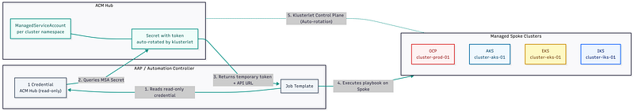

**How the Resolution Flow Works (Step-by-Step):**

- **1. Read Hub Credential:** The Job Template in AAP/AWX accesses the single `acm-spoke-reader` credential registered in the controller.
- **2. Query MSA Secret:** Using this read-only identity, the resolver queries the ACM Hub for the target cluster's `ManagedServiceAccount` Secret.
- **3. Extract Ephemeral Token:** The Hub returns a short-lived bearer token (issued via `TokenRequest`) along with the target cluster's API URL.
- **4. Execute Automation:** The playbook uses the resolved token and API endpoint to execute tasks directly on the spoke cluster (OCP or xKS).
- **5. Background Rotation (Klusterlet Control Plane):** Operating independently in the background, the klusterlet agent on the spoke continuously rotates and syncs fresh tokens back to the Hub before expiration.

> **🚀 The Bottom Line:**
>
> The same fleet of 50 clusters now runs on **1 read-only credential** in AAP or AWX. Tokens have a configurable TTL (default: 30 days) and renew automatically. New clusters get onboarded in **under a minute**, and revoking access across any spoke is a **single command** on the Hub.

**Comparison Metrics (Static Tokens vs. ACM Spoke Collection):**

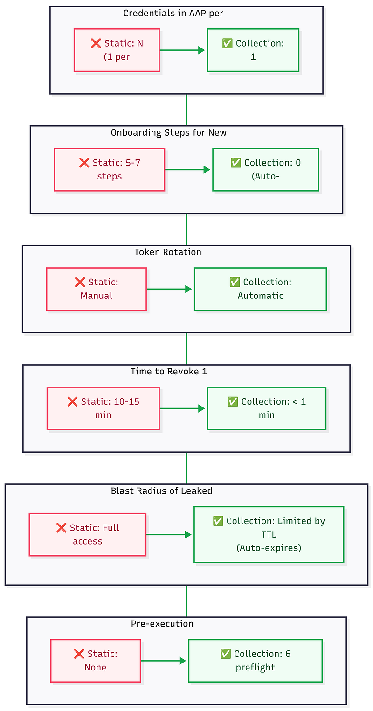

**Key Security & Operational Impact Breakdown:**

- **1. Credentials Stored in Controller:** Drops from **N static tokens** (one per cluster) down to **1 single read-only Hub credential** across your entire AAP or AWX fleet.
- **2. Onboarding Manual Steps:** Reduced from **5 to 7 manual tasks** per cluster (creating SAs, extracting tokens, mapping AAP secrets) down to **0 manual steps** via ACM auto-discovery.
- **3. Token Rotation Engine:** Replaces **manual, rarely-executed token rotation** with **100% automated lifecycle management** handled natively by the spoke klusterlet.
- **4. Access Revocation Speed:** Slashes time-to-revoke from **10 to 15 minutes** of context-switching across cluster APIs down to **under 1 minute** using a single command on the Hub.
- **5. Leaked Token Blast Radius:** Shifts from **permanent, unrestricted `cluster-admin` access** to **ephemeral, auto-expiring bearer tokens** constrained by strict TTLs.
- **6. Pre-Execution Validation:** Upgrades from **zero preflight verification** (failing mid-playbook) to **6 automated preflight checks** executed before reading the token.

## 🔑 How it works: three ServiceAccounts in layers

The collection uses three ServiceAccounts, each configured with minimum permissions for its explicit role. This is the core architectural detail that usually takes a minute to click: the daily-use credential registered in AAP/AWX is **read-only on the Hub**, yet the token it retrieves carries **`cluster-admin` on the spoke**. They are two separate identities living on two different clusters.

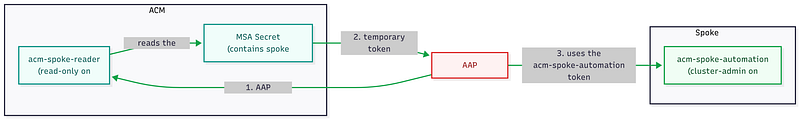

**Resolution Lifecycle Breakdown:**

- **1. Read-Only Hub Auth:** AAP or AWX initiates the job using the `acm-spoke-reader` token stored in the controller credential.
- **2. MSA Secret Lookup:** The reader ServiceAccount queries the Hub to read the target cluster's `ManagedServiceAccount` Secret.
- **3. Ephemeral Token Extraction:** The Hub hands back the short-lived bearer token synced by the klusterlet.
- **4. Direct Spoke Execution:** AAP/AWX uses this resolved `acm-spoke-automation` token to execute playbook tasks directly against the target spoke cluster.

> **🛡️ The Key Security Boundary:**
>
> The `acm-spoke-reader` **never connects to the spoke cluster**. It only reads the Kubernetes Secret residing on the Hub, where ACM's ManagedServiceAccount controller synced the temporary `TokenRequest` token.

**ServiceAccounts Architecture Breakdown:**

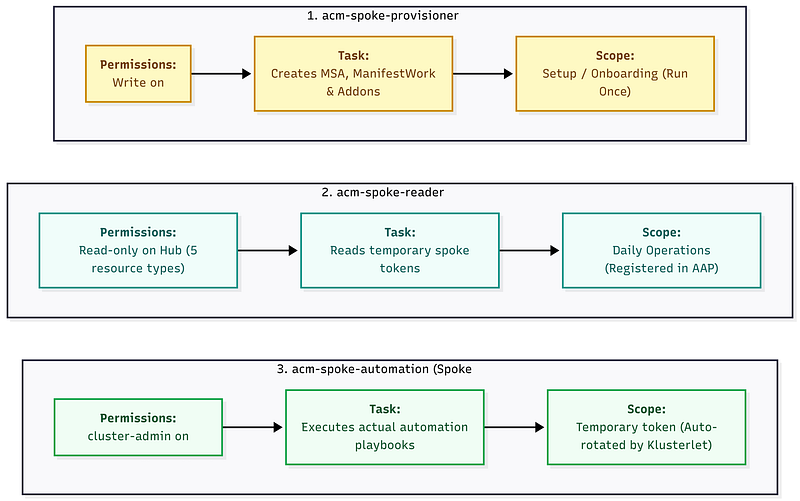

**The Three Operational Layers:**

- **1. `acm-spoke-provisioner` (Lives on Hub):** Write permissions on the Hub (creates MSA, ManifestWork, and enables addons). Used exclusively during initial setup (once per cluster). You can safely remove it from AAP or AWX after onboarding completes.
- **2. `acm-spoke-reader` (Lives on Hub):** Read-only permissions on the Hub (limited to 5 specific resource types). Zero permissions on any spoke cluster. This is the **sole identity registered as a credential** inside AAP or AWX for day-to-day operations.
- **3. `acm-spoke-automation` (Lives on Spoke):** `cluster-admin` privileges on the target spoke (configurable). Created automatically on the spoke by the klusterlet via MSA. It uses an ephemeral token with a configurable TTL (default 30 days) that rotates automatically. This is the actual token your playbook tasks execute with.

> **💡 Why is the reader read-only if the spoke token has `cluster-admin`?**
>
> Because they are **separate identities**. The `acm-spoke-reader` lives on the Hub and can only read. The `acm-spoke-automation` lives on the spoke and holds the real execution permissions. If the reader token leaks, an attacker can only view spoke tokens that will expire on their own anyway. They cannot create new tokens, escalate privileges, or modify anything on either cluster.

The spoke role is fully configurable. If your downstream automation only needs `view` or `edit` access, set `acm_spoke_token_setup_spoke_cluster_role` during onboarding, and the ManifestWork will apply the exact ClusterRole you specify.

## 🎛️ Setting it up in AAP or AWX

The collection ships with everything needed to run on AAP or AWX: a dedicated Execution Environment (EE) definition, three custom Credential Types, and Job Template specs ready to create in the UI or import via Configuration as Code (CaC).

### AAP / AWX Objects Overview

- **1. Execution Environment (Custom):** EE with `oc` CLI + `kubernetes.core` + the collection itself.
- **2. Project (SCM / Git):** Points to the `dfmateus.acm_spoke` repository.
- **3. Credential Types (Custom x3):** Bootstrap (`cluster-admin`), Resolver (`acm-spoke-reader`), and Setup (`acm-spoke-provisioner`).
- **4. Credentials (Instance):** One credential per type and per environment (Lab, Prod).
- **5. Inventory (Static):** `localhost` with `ansible_connection: local`.
- **6. Job Templates (Wrapper x3):** Bootstrap, Resolver, and Setup.

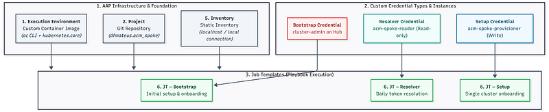

**Architecture Mapping Breakdown:**

- **1. Execution Environment:** Container runtime supplying the required binaries (`oc` CLI) and Python libraries (`kubernetes`) for API-driven playbook execution.
- **2. Project & Inventory:** Connects directly to Git for playbook source code and executes locally against `localhost` using API calls instead of SSH.
- **3. Custom Credential Types:** Enforces strict permission isolation between initial fleet setup, daily token resolution, and single-cluster onboarding.
- **4. Credentials:** Maps the specific ServiceAccount tokens (such as the read-only Hub token) to target controller environments.
- **5. Job Templates:** Wraps the collection playbooks into executable automation jobs inside your AAP or AWX UI.

> **💡 Configuration as Code (CaC) Ready:**
>
> To avoid manual UI configuration, you can import all of these objects directly using the `infra.controller_configuration` collection (or `awx.awx`). Ready-to-import YAML and JSON schema definitions for all 3 Credential Types, 3 Job Templates, Inventory, and Project are available in the repository at [examples/aap/](https://github.com/dfmateus/acm_spoke/tree/main/examples/aap) and [examples/credentials/](https://github.com/dfmateus/acm_spoke/tree/main/examples/credentials).

### Execution Environment

An **Execution Environment (EE)** is a containerized image that packages everything needed to run your playbooks consistently inside AAP or AWX: the Python runtime, system dependencies, Ansible collections, and CLI tools.

Because our collection interacts directly with Kubernetes APIs and shells out for specific CLI checks, it requires an EE containing the `oc` and `kubectl` binaries, the Python `kubernetes` client, and `kubernetes.core`. The repository includes a ready-to-build definition at `examples/ee/execution-environment.yml` based on `ee-minimal-rhel9`.

Build and register it in your container registry and controller:

```bash
# Build the EE from the repository root
ansible-galaxy collection build . --output-path . --force
ansible-builder build -t acm-spoke-token-resolver-ee:1.0.1 -f examples/ee/execution-environment.yml
```

Register the image in AAP or AWX under **Administration > Execution Environments**:

- **Name:** `EE - ACM Spoke 1.0.1`
- **Image:** `<registry-url>/acm-spoke-token-resolver-ee:1.0.1`
- **Pull policy:** Missing

### Project

- **Name:** `ACM Spoke Collection (main)`
- **SCM Type:** Git
- **SCM URL:** Repository URL (GitHub or internal Git)
- **SCM Branch:** `main`
- **SCM Update on Launch:** true

### Inventory

- **Name:** `ACM Spoke - <ENV>`
- **Variables:** `ansible_connection: local`
- **Host:** `localhost`

> The collection runs entirely on `localhost`. It connects to the Hub and spokes through API calls, not SSH.

### Custom Credential Types

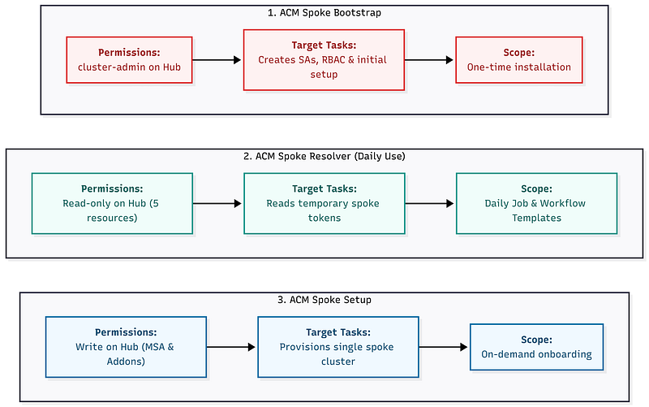

- **1. ACM Spoke Bootstrap (`cluster-admin`):** Used by the Bootstrap JT. Injects a `cluster-admin` token on the Hub to create ServiceAccounts, RBAC, MSA CRs, and ManifestWorks during initial setup.
- **2. ACM Spoke Resolver (`read-only`, daily use):** Used by the Resolver JT. Injects the `acm-spoke-reader` token, which has read-only access to 5 resource types on the Hub and zero permissions on spoke clusters.
- **3. ACM Spoke Setup (`provisioner`):** Used by the Setup JT. Injects the `acm-spoke-provisioner` token, providing write access to create MSA CRs, ManifestWorks, and Addons for onboarding single clusters on demand.

### Job Templates

Each Job Template maps to one playbook and one Credential Type. All three use the custom EE and the `localhost` inventory:

- **ACM Spoke Bootstrap:** Runs `playbooks/bootstrap_hub_spoke.yml` with the Bootstrap credential (`cluster-admin`). Creates Hub SAs and RBAC, auto-discovers all ManagedClusters, provisions MSA and ManifestWork on each spoke, and validates access. Add an optional survey field `target_clusters` (text) to specify a subset of clusters. If left empty, it processes every spoke on the Hub. Extra vars: `var_no_log: true`. Run once for initial setup and again whenever new clusters join the fleet. The entire playbook is idempotent.
- **ACM Spoke Resolver:** Runs `playbooks/resolve_spoke_access.yml` with the Resolver credential (`acm-spoke-reader`, read-only). This is the daily-use template. Add a required survey field `target_cluster` (text) so the operator specifies which spoke to resolve. The resolver runs 6 preflight checks before reading the MSA Secret. If any check fails, the job output shows the exact problem and the `oc` command to diagnose it. Extra vars: `var_no_log: true`.
- **ACM Spoke Setup:** Runs `playbooks/setup_spoke_cluster.yml` with the Setup credential (`acm-spoke-provisioner`). Provisions a single spoke without re-running the full bootstrap. Add a required survey field `target_cluster` (text). Use this to onboard one cluster without touching the rest.

## 🔧 Using the resolver in your automation

There are two ways to consume the resolver in AAP or AWX. Pick the one that fits your use case.

### Option A: Workflow Template (resolver as a separate JT node)

Use this when you already have existing Job Templates that operate on spoke clusters and you want to prepend token resolution without modifying their playbooks. The resolver JT runs first, resolves the spoke token, and passes `spoke_token`, `spoke_api_url`, and `spoke_validate_certs` to the next node via `set_stats`. The downstream JT receives them as extra vars automatically.

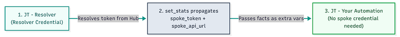

**Workflow Execution Breakdown:**

- **1. Initial Token Resolution:** Node 1 (Resolver JT) authenticates against the Hub using the read-only credential and extracts the ephemeral spoke token.
- **2. Fact Export via `set_stats`:** The resolver playbook executes `ansible.builtin.set_stats` to expose `spoke_token`, `spoke_api_url`, and `spoke_validate_certs` to the workflow context.
- **3. Downstream Playbook Execution:** Node 2 (your custom playbook) receives these variables automatically as extra vars and executes tasks on the spoke without needing a cluster credential attached to its template.

The resolver playbook already includes `set_stats` at the end:

```yaml
- name: "Export facts to the next workflow node"
  ansible.builtin.set_stats:
    data:
      spoke_token: "{{ acm_spoke_token_resolver_spoke_token }}"
      spoke_api_url: "{{ acm_spoke_token_resolver_spoke_api_url }}"
      spoke_validate_certs: "{{ acm_spoke_token_resolver_spoke_validate_certs }}"
    per_host: false
  no_log: true
```

> **🔒 Security Notice: Sensitive Data Sanitization**
>
> Always enforce `no_log: true` on tasks handling resolved facts. Without it, Ansible Controller will print raw API tokens directly to the Job Output and Workflow Stats. Adding `no_log: true` guarantees that:
>
> - Ephemeral bearer tokens are redacted (`censored`) in job runs.
> - Credentials stay out of downstream log stream destinations (e.g., SIEMs, Splunk, Elastic).
> - Audit logs stay clean and free of leaked tokens.

The downstream JT playbook consumes the facts as regular extra vars:

```yaml
- name: "Health check on spoke cluster"
  hosts: localhost
  connection: local
  gather_facts: false
  tasks:
    - name: "List nodes on the spoke"
      kubernetes.core.k8s_info:
        api_key: "{{ spoke_token }}"
        host: "{{ spoke_api_url }}"
        validate_certs: "{{ spoke_validate_certs }}"
        kind: Node
      register: __spoke_nodes
      no_log: true

    - name: "Check node readiness"
      ansible.builtin.debug:
        msg: "{{ item.metadata.name }}: {{ item.status.conditions
          | selectattr('type', 'equalto', 'Ready')
          | map(attribute='status') | first }}"
      loop: "{{ __spoke_nodes.resources }}"
      loop_control:
        label: "{{ item.metadata.name }}"
```

> **💡 Which option should you choose?**
>
> Pick **Option A** if you already have standard playbooks in Git that you want to reuse without changing a single line of code. If you prefer keeping everything inside a single Job Template without creating Workflow nodes, **Option B** below is the way to go.

### Option B: include_role in your own playbook (single JT, no Workflow needed)

Use this pattern when writing a new playbook that needs spoke access. You call the resolver role with `include_role` at the top of your playbook, and all subsequent tasks use the resolved facts directly. This runs as a single Job Template in AAP or AWX with the Resolver credential attached.

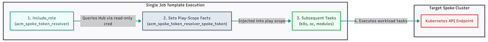

**In-Play Execution Breakdown:**

- **1. In-Play Role Execution:** The playbook invokes `dfmateus.acm_spoke.acm_spoke_token_resolver` as its first task, authenticating to the Hub using the attached Resolver credential.
- **2. Play-Scope Fact Injection:** The resolver sets `acm_spoke_token_resolver_spoke_token`, `acm_spoke_token_resolver_spoke_api_url`, and `acm_spoke_token_resolver_spoke_validate_certs` directly in memory.
- **3. Direct Task Execution:** Subsequent tasks within the same play consume these facts immediately to manage resources on the target cluster.
- **4. Spoke API Interaction:** Commands and `kubernetes.core` modules communicate directly with the spoke API endpoint without passing through intermediate workflow nodes.

Here is a complete playbook example using this pattern:

```yaml
---
- name: "Deploy workload to spoke cluster via ACM resolver"
  hosts: localhost
  connection: local
  gather_facts: false
  tasks:
    - name: "Resolve spoke access via ACM Hub"
      ansible.builtin.include_role:
        name: dfmateus.acm_spoke.acm_spoke_token_resolver
      vars:
        acm_spoke_token_resolver_target_cluster: "{{ target_cluster }}"

    - name: "Create namespace on the spoke"
      kubernetes.core.k8s:
        api_key: "{{ acm_spoke_token_resolver_spoke_token }}"
        host: "{{ acm_spoke_token_resolver_spoke_api_url }}"
        validate_certs: "{{ acm_spoke_token_resolver_spoke_validate_certs }}"
        state: present
        definition:
          apiVersion: v1
          kind: Namespace
          metadata:
            name: my-app
      no_log: true

    - name: "Deploy application ConfigMap"
      kubernetes.core.k8s:
        api_key: "{{ acm_spoke_token_resolver_spoke_token }}"
        host: "{{ acm_spoke_token_resolver_spoke_api_url }}"
        validate_certs: "{{ acm_spoke_token_resolver_spoke_validate_certs }}"
        state: present
        definition:
          apiVersion: v1
          kind: ConfigMap
          metadata:
            name: app-config
            namespace: my-app
          data:
            environment: production
      no_log: true
```

The Job Template in AAP or AWX requires the **Resolver credential** (which injects `acm_spoke_token_resolver_hub_url` and `acm_spoke_token_resolver_hub_token`) and a survey field for `target_cluster`.

## 🌐 Multi-Cluster Operations in a Single Playbook

You can also loop over multiple spokes within a single playbook run. The resolver is idempotent, making it safe to call multiple times with different cluster names:

```yaml
---
- name: "Multi-cluster health check"
  hosts: localhost
  connection: local
  gather_facts: false
  vars:
    clusters_to_check:
      - spoke-aro-01
      - spoke-aks-01
      - spoke-iks-01
  tasks:
    - name: "Resolve and check each spoke"
      ansible.builtin.include_tasks: tasks/check_single_spoke.yml
      loop: "{{ clusters_to_check }}"
      loop_control:
        loop_var: __cluster_name
        label: "{{ __cluster_name }}"
```

```yaml
---
# tasks/check_single_spoke.yml
- name: "Resolve access for {{ __cluster_name }}"
  ansible.builtin.include_role:
    name: dfmateus.acm_spoke.acm_spoke_token_resolver
  vars:
    acm_spoke_token_resolver_target_cluster: "{{ __cluster_name }}"

- name: "List nodes on {{ __cluster_name }}"
  kubernetes.core.k8s_info:
    api_key: "{{ acm_spoke_token_resolver_spoke_token }}"
    host: "{{ acm_spoke_token_resolver_spoke_api_url }}"
    validate_certs: "{{ acm_spoke_token_resolver_spoke_validate_certs }}"
    kind: Node
  register: __nodes
  no_log: true

- name: "{{ __cluster_name }}: {{ __nodes.resources | length }} nodes"
  ansible.builtin.debug:
    msg: "{{ __cluster_name }} - {{ __nodes.resources | length }} nodes"
```

> **💡 Multi-Cloud Portability Made Simple**
>
> This multi-cluster pattern works identically across OpenShift spokes (OCP, ARO, ROSA on **port 6443**) and xKS spokes (AKS, EKS, GKE on **port 443**). The resolver auto-detects the API URL and TLS settings for each cluster, keeping your downstream tasks **100% platform-agnostic**.

## 🔌 Real-world downstream examples

Whether you use **Option A (Workflow)** or **Option B (`include_role`)**, downstream automation is identical. Here are common spoke-level tasks that work on any platform:

**1. Collect must-gather from an OpenShift spoke (OCP, ARO, ROSA):**

```yaml
- name: "Run must-gather on the spoke"
  ansible.builtin.command:
    cmd: >-
      oc adm must-gather
      --token={{ spoke_token }}
      --server={{ spoke_api_url }}
      --dest-dir=/tmp/must-gather-{{ target_cluster }}
  no_log: true
```

**2. Check TLS secrets on a spoke (OCP, ARO, ROSA):**

```yaml
- name: "List secrets of type TLS"
  kubernetes.core.k8s_info:
    api_key: "{{ spoke_token }}"
    host: "{{ spoke_api_url }}"
    validate_certs: "{{ spoke_validate_certs }}"
    kind: Secret
    namespace: openshift-ingress
    field_selectors:
      - type=kubernetes.io/tls
  register: __tls_secrets
  no_log: true
```

**3. Scale a deployment during an incident (any xKS or OCP):**

```yaml
- name: "Scale down problematic deployment"
  kubernetes.core.k8s:
    api_key: "{{ spoke_token }}"
    host: "{{ spoke_api_url }}"
    validate_certs: "{{ spoke_validate_certs }}"
    kind: Deployment
    name: "{{ deployment_name }}"
    namespace: "{{ namespace }}"
    definition:
      spec:
        replicas: "{{ target_replicas }}"
  no_log: true
```

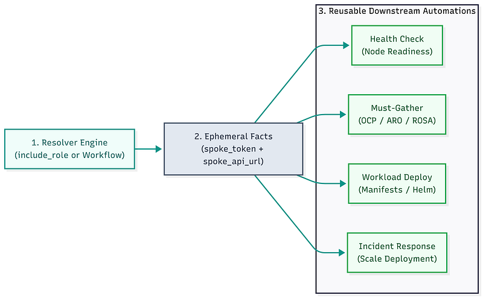

**Automation Reuse Breakdown:**

- **1. Centralized Resolution:** The resolver executes once, authenticating against the Hub to obtain temporary access for the target spoke.
- **2. Uniform Fact Structure:** The resolver outputs standardized facts (`spoke_token`, `spoke_api_url`, `spoke_validate_certs`) regardless of the target cloud provider or Kubernetes distribution.
- **3. Decoupled Playbook Execution:** Any downstream playbook — from health checks and diagnostics to workload deployments and incident scaling — consumes these identical facts without storing cluster credentials.

> **🛡️ Zero Credential Management in Playbooks:**
>
> In both options, downstream playbooks never handle persistent credentials. They receive an ephemeral bearer token that expires automatically. You can build a whole library of spoke automations in AAP or AWX sharing the same resolver, the same read-only Hub credential, and the same Execution Environment.

## 🌐 TLS auto-detection

> **🌐 Automated Multi-Cloud Certificate Handling**
>
> One detail that saves time in multi-cloud fleets: the resolver auto-detects whether to validate TLS certificates based on the ManagedCluster's `vendor` label. OpenShift clusters (OCP, ARO, ROSA) use public CAs, setting `validate_certs: true`. Kubernetes clusters (AKS, EKS, GKE) use internal CAs, setting `validate_certs: false`. No per-cluster TLS configuration is needed in AAP or AWX!

## 🖥️ Platform support

The collection works with any Kubernetes distribution imported as a `ManagedCluster` (a.k.a. **spoke**) on the ACM Hub. The MSA API and ManifestWork operate purely through the **klusterlet**, with **zero dependency** on OpenShift-specific APIs on the spoke side.

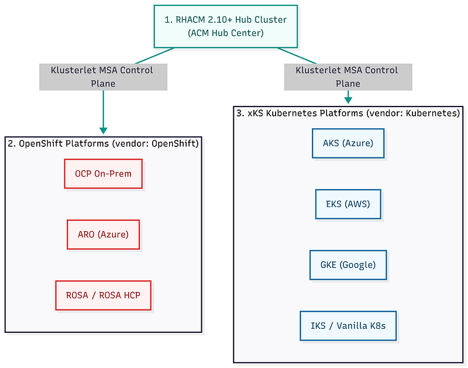

**Platform Topology Breakdown:**

- **1. Central Hub Control Plane:** Requires RHACM 2.10+ with the `managed-serviceaccount` addon enabled to orchestrate token requests.
- **2. OpenShift Native Ecosystem (`vendor: OpenShift`):** Full feature set support across OCP On-Prem, Azure Red Hat OpenShift (ARO), and Red Hat OpenShift on AWS (ROSA / ROSA HCP).
- **3. Any Managed Kubernetes (`vendor: Kubernetes`):** Platform-agnostic token issuance and rotation for Azure Kubernetes Service (AKS), Amazon EKS, Google GKE, IBM Cloud IKS, and upstream Vanilla Kubernetes (requiring an active klusterlet agent).

**Validated Fleet Compatibility:**

- **OpenShift Family (`vendor: OpenShift`):** OCP On-Prem, ARO, ROSA, and ROSA HCP.
- **xKS Ecosystem (`vendor: Kubernetes`):** AKS, EKS, GKE, IBM IKS, and Vanilla Kubernetes (requires active klusterlet).

> **🧪 Real-world Test Results:** Validated in a live RHACM 2.12+ environment across ARO, ROSA, and xKS clusters (AKS, EKS, and IKS). All **16 end-to-end tests passed**.

## ⚡ What changes in practice

**⚡ Day-2 Impact at a Glance**

- **New cluster joins the fleet:** Without the collection, someone logs into the new cluster, creates a ServiceAccount, extracts the token, and registers a new credential in AAP or AWX (taking **10 to 15 minutes**). With the collection, launch the Bootstrap JT: it auto-discovers and provisions the new cluster in **under a minute**, completely idempotently.
- **Security incident requires immediate revocation:** Delete the `ManagedServiceAccount` CR on the Hub. The klusterlet removes the SA on the spoke automatically in **under a minute** with a single command. Even if you do nothing, the token expires automatically when its TTL runs out.
- **Quarterly compliance audit:** Eliminates credential silos. All `ManagedServiceAccount` CRs stay on the Hub with status, TTL, and Kubernetes API audit logs visible and centralized.

## ⚠️ Limitations and known constraints

**⚠️ Prerequisites & Operational Considerations**

- **RHACM Version:** Requires **RHACM 2.10 or later** on the Hub cluster with the `managed-serviceaccount` addon enabled.
- **Klusterlet Health:** The klusterlet must be active on each spoke for token rotation. If a spoke stays offline longer than the token TTL, the token expires and the resolver reports a preflight failure.
- **Rotation Engine:** Token rotation is handled entirely by the klusterlet (the single source of truth), not by Ansible itself.
- **Dependencies:** Built exclusively with standard `kubernetes.core` and `ansible.builtin` modules, requiring only the `oc` CLI inside the Execution Environment.
- **Job Execution Window:** Ephemeral tokens issued via `TokenRequest` carry a defined TTL, safely supporting long-running playbook runs.

## 🏁 Wrap up

The collection is at **version 1.0.1**. Molecule tests, GitHub Actions CI, and expanded multi-cloud validation are actively on the roadmap.

🤔 **Ready to eliminate static cluster tokens?**

🚀 Grab the collection from Ansible Galaxy or check out the playbooks, architecture, and CaC examples on GitHub:

```bash
ansible-galaxy collection install dfmateus.acm_spoke
```

- 🔗 **GitHub Repository:** [https://github.com/dfmateus/acm_spoke](https://github.com/dfmateus/acm_spoke)

*Contributions, issues, and feature requests are welcome!*
